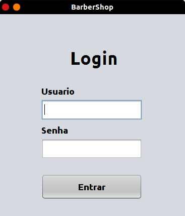
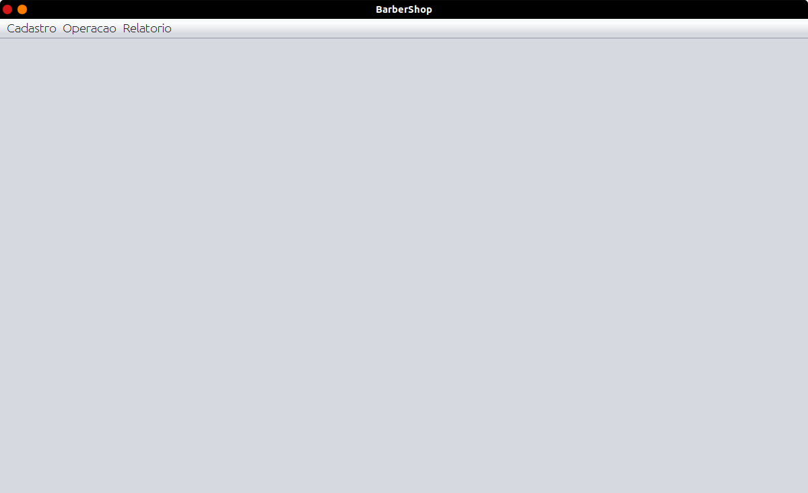
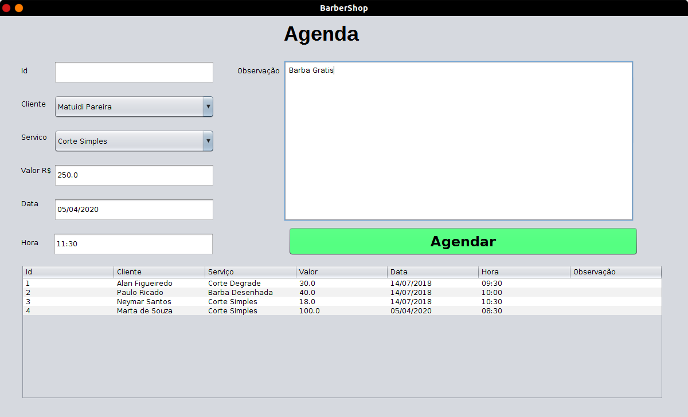

<h1>BarberShop</h1>

This system was made to manage customer schedules in a barber shop. It does not use a database, but an arrayList.

Development based on the standard MVC architecture using Java JFrames to make the screens.

Project made from a course on youtube: <a href="https://www.youtube.com/playlist?list=PLJIP7GdByOyuBKB--fIO2DoQaPVXm9lCw">Projeto em Java - Barbearia</a>

<b>Credits: </b><a href="https://www.youtube.com/channel/UCI4mJ2FXeA-RuDbwZA0z_MA">Tiago Luz</a>.

Go for me, this is a great course, it gets even better than my classes in the technical course, <a href="https://www.instagram.com/tiagoluz_oficial/">Tiago</a> explains it very well, I recommend it to everyone.

To login use:
<b>user: </b>barbeiro
<b>password: </b>barbeiro

<h2>🎨 Screenshots</h2>

<h2>📬 License</h2>

This software was created for study purposes only, and is under the <a href="https://opensource.org/licenses/MIT">MIT License</a>
